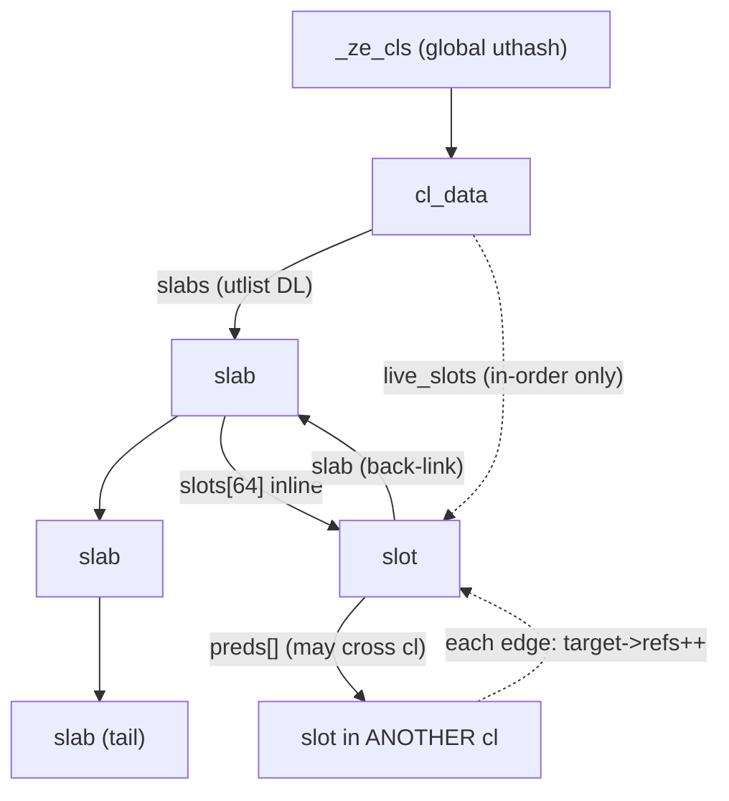
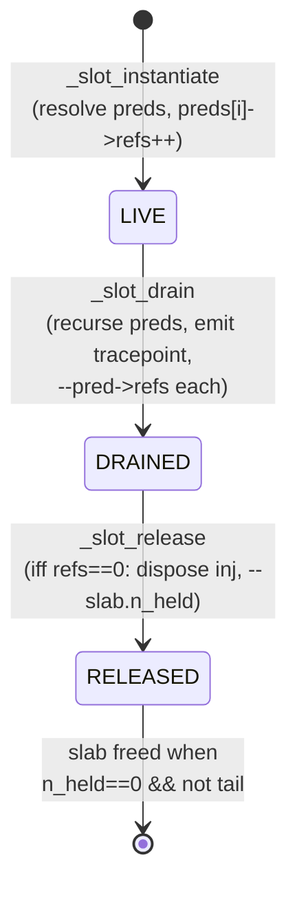
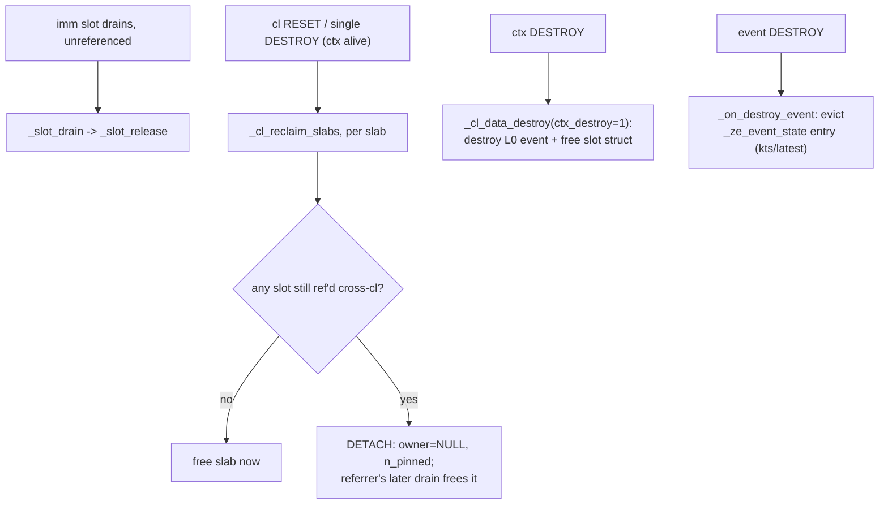

# How to Update the Header

## Header Location

- Standard: `https://github.com/argonne-lcf/level-zero-spec/tree/ddi_ver`
- Loader: `https://github.com/oneapi-src/level-zero/tags`
- Extension: `https://github.com/intel/compute-runtime/blob/master/level_zero/include/level_zero/driver_experimental/zex_api.h`

# Steps:

## 1/ Loader Repo

- We will use the loader repo to get most of the headers. The loader contains the spec header (`ze_api.h`) and the loader-specific API (`loader/ze_loader.h`).

  - Note: It is preferable to have a loader already installed on your system:
     - We may need it to check for symbols that are "defined in the header but not exported by the lib"
     - We are wary of exposing a newer loader than the system one, as users may request symbols that we cannot forward

  - If you have access to a Level Zero lib, compile and run:
```bash
$ icpx -lze_loader utils_spec_update/query_ze_version.cpp  && ./a.out
Driver version: 259.33578
API version: 1.13
Loader component versions:
  [0] Name:        loader
      Spec:        1.13
      Lib version: 1.24.0
  [1] Name:        tracing layer
      Spec:        1.13
      Lib version: 1.24.0
```
   - This will give you the loader version.

- If you have access to a loader, you can copy/paste the `/usr/include/level_zero/` folder into `$THAPI_ROOT/backend/ze/include/`.
  If not, use `git clone --depth 1 --branch $(lib_version) https://github.com/oneapi-src/level-zero.git`, where `lib_version` is the version you want.
  To find the latest lib version of the loader released, run:
```bash
$ git ls-remote --sort="v:refname"  --tags  https://github.com/oneapi-src/level-zero.git | tail  -1
6369d8d642e9c7625e67f38664267f171b8e42dc        refs/tags/v1.28.2
```

### Note on `ze_loader_api.h`

- We need also to copy / paste  `source/loader/ze_loader_api.h`. The loader export it, so we export it too, just in case.
- Those header, are a nighmare.
  - 1/ C++ header: We modify them manually to remove any C++
  - 2/ We split them by namespace: 
    - `ze_loader`, contain `zel`,
    - `ze_loader_api_ze_namespace.h` contain the `ze`.

## 2/ DDI Ver

### Sync

- Sync the fork (` https://github.com/argonne-lcf/level-zero-spec.git`) with the original remote
- Sync the `ddi_ver` branch

### Building `ddi_table`

Then we will build the `ddi_table` corresponding to the Level Zero API version.

If you don't know the Header/API version associated with the driver previously used, you can grep for `ZE_API_VERSION_CURRENT`:
```bash
$ grep define ZE_API_VERSION_CURRENT ./level_zero/ze_api.h | head -1
ZE_API_VERSION_CURRENT = ZE_MAKE_VERSION( 1, 13 ),                      ///< latest known version
```

Now it's time to generate `ddi_ver.h`:
```bash
git clone -b ddi_ver https://github.com/argonne-lcf/level-zero-spec.git
cd level-zero-spec/scripts/
uv pip install -r third_party/requirements.txt
python run.py  --ver $version --\!debug --\!html
```

- The headers will be generated in `level-zero-spec/include/`. Copy `../include/*_ddi_ver.h` into `$THAPI_ROOT/backend/ze/include/`.
- You can sanity-check that the headers are the same And that `ZE_API_VERSION_CURRENT_M` define the same version
```
grep "ZE_API_VERSION_CURRENT" ../include/ze_api.h # Sanity check
    ZE_API_VERSION_CURRENT = ZE_MAKE_VERSION( 1, 13 ),                      ///< latest known version
#ifndef ZE_API_VERSION_CURRENT_M
#define ZE_API_VERSION_CURRENT_M  ZE_MAKE_VERSION( 1, 15 )
#endif // ZE_API_VERSION_CURRENT_M
```
(We don't talk about `ZE_API_VERSION_CURRENT_M`...)

- Note that `layers/zel_tracing_ddi_ver.h` is not generated manually, and need manual update.
    - We remove all the C++, and all the weird important who bring symbol for other namespace.

## 3/ Optional: ZEX

- We are missing the `zex` header:
- Found at `https://github.com/intel/compute-runtime/blob/master/level_zero/include/level_zero/driver_experimental/zex_api.h`

## Now Try to Compile:

- Try to compile

## 4/ Add medatadata

You can use the `check_metadata.py` script to help you indentify  function which need update and then figure it out.

# Potential Problems, Thinks to check

## 0

Run `utils_spec_update/test_symbol_exported.sh $loader_so $out_so`
If symbol are not exposed by the loader, but are exposed by us it's a bug!
Add a patch to comment them in `header.path`.

```
$ bash ./utils_spec_update/test_symbol_exported.sh /usr/lib64/libze_loader.so ~/project/p26.04/THAPI/build/ici/lib/thapi/ze/libze_loader.so
--- /usr/lib64/libze_loader.so
+++ /home/applenco/project/p26.04/THAPI/build/ici/lib/thapi/ze/libze_loader.so
@@ -240,6 +240,7 @@
 zelLoaderContextTeardown
 zelLoaderDriverCheck
 zelLoaderGetContext
+zelLoaderGetVersion
 zelLoaderGetVersions
 zelLoaderGetVersionsInternal
 zelLoaderTracingLayerInit
@@ -444,6 +445,7 @@
 zelTracerRTASParallelOperationGetPropertiesExtRegisterCallback
 zelTracerRTASParallelOperationJoinExpRegisterCallback
 zelTracerRTASParallelOperationJoinExtRegisterCallback
+zelTracerResetAllCallbacks
 zelTracerSamplerCreateRegisterCallback
 zelTracerSamplerDestroyRegisterCallback
 zelTracerSetEnabled
```

One possibility is to do:
```
cp -r ../../build/backends/ze/modified_include .
// Modify `modified_include`
diff -u4 -r --new-file include/ modified_include/ > headers.patch
```

## 1

```
tracer_ze.c:197:8: error: use of undeclared identifier 'ZE_STRUCTURE_TYPE_DEVICE_CACHE_LINE_SIZE_EXT'; did you mean 'ZE_STRUCTURE_TYPE_DEVICE_CACHELINE_SIZE_EXT'?
  197 |   case ZE_STRUCTURE_TYPE_DEVICE_CACHE_LINE_SIZE_EXT:
      |        ^~~~~~~~~~~~~~~~~~~~~~~~~~~~~~~~~~~~~~~~~~~~
      |        ZE_STRUCTURE_TYPE_DEVICE_CACHELINE_SIZE_EXT
```

Due to Intel's lack of naming consistency, you may need to update the `struct_type_conversion_table` in `ze_model.rb`.

## 2

```
tracer_ze.c:8456:20: error: unused function 'zelTracerResetAllCallbacks_hid' [-Werror,-Wunused-function]
 8456 | static ze_result_t zelTracerResetAllCallbacks_hid(zel_tracer_handle_t hTracer)__attribute__ ((alias ("zelTracerResetAllCallbacks")));
      |                    ^~~~~~~~~~~~~~~~~
```
Need to modify the `$zel_commands.each` block that generates `#{c.decl_hidden_alias};` in `gen_ze.rb`.

## 3

Runtime error: When running `babeltrace_thapi` (`iprof -t`), constant error:
```
PogrammableParamValueInfoExp>': uninitialized constant ZE::ZETMetricProgrammableParamValueInfoExp::ZET_MAX_METRIC_PROGRAMMABLE_VALUE_DESCRIPTION_EXP (NameError)

           :description, [ :char, ZET_MAX_METRIC_PROGRAMMABLE_VALUE_DESCRIPTION_EXP ]
```
Update in `backends/ze/gen_ze_library.rb`, Module ZE.
TODO: `h2yaml` should be able to find all the constants defined.

# Timestamp profiling architecture

This documents the runtime bookkeeping in `tracer_ze_helpers.include.c` /
`ze_model.rb` that measures how long each submitted command takes.

## Why it needs bookkeeping at all

The goal is to measure each command submitted to the GPU. The only way is to
read a profiling event the command signals. The subtlety: users are free to
re-signal, share, and reset their events. So:

- **If the user passes no signal event**, we inject our own and signal it.
- **If the user passes a signal event**, we swap in our injected event, then
  re-expose the user's event (a chained SignalEvent / Barrier) so their code
  still works.

At synchronization time we host-read our injected event to get the real kernel
timing. Two API facts stop this from being a simple per-event list:

1. **Users sync more than events** — a whole command list, a queue, or a fence,
   not just `zeEventHostSynchronize`. So we must track, per command list, the
   set of outstanding profiled commands (and a live count, to know when a cl is
   fully drained).
2. **A command signaled on one cl can be waited on from another** (cross-cl
   `phWaitEvents`). So the dependency chain spans command lists, and a command's
   storage must outlive its own cl being reset/destroyed while another cl still
   depends on it (the **detach** mechanism).

Each profiled Append becomes a **slot** (injected event + dependency edges +
refcount). Slots are grouped per cl in fixed-size **slabs** (so cl/queue/fence
sync can find them) but linked by raw pointers across cls (for the dependency
chain).

## Ownership



Slabs grow by appending (never realloc), so a slot's address is stable for as
long as it lives — required, because other slots hold raw pointers to it.

**Why the slot -> slab back-link:** `_slot_drain` / `_slot_release` are entered
holding only a bare slot pointer (a pred in another cl). To reach the counters
or the owning cl they walk up via `slot->slab->owner`. The slab knows its slots
(inline array); the slot must know its slab for the reverse direction.

## Counters

| counter | on | meaning |
|---|---|---|
| `n_used` | slab | slots ever handed out (monotonic) |
| `n_held` | slab | slots not yet `_slot_release`'d (`n_used` − releases) |
| `n_pinned` | slab | >0 only when **detached**: # slots still referenced cross-cl |
| `refs` | slot | # live downstream slots whose `preds[]` point at this slot |

`refs` is a **count, not a list** — we only ask "does anyone still depend on
me?", never "who?". A slot is freed only when `live==0` (drained itself) AND
`refs==0` (nobody points at it); the last dependent to drop the ref frees it.
That is what lets us avoid a reverse index (see the detach note below).

## Slot state machine



## Teardown paths



**Detach (`owner=NULL`).** Consider:

```
CL1.Append(signal=e1)            // slot P
CL2.Append(signal=e2, wait=e1)   // slot Q; Q.preds=[P], so P.refs=1
CL1.destroy()                    // P still referenced by Q -> P DETACHED
CL2.sync()                       // drains Q, --P.refs -> 0, frees P's slab
```

At `CL1.destroy()`, `CL2` still has a pred pointing into `CL1`'s slab (legal L0 —
there is no ordering rule for cross-cl event deps, unlike fences/queues), so
freeing that slab would dangle `Q.preds[]`. Instead the slab is *detached*
(unlinked, `owner=NULL`, `n_pinned` = referenced slots) and outlives `CL1`. Then
`CL2.sync()` drains `Q`, drops the last ref on `P` (`--P.refs -> 0`), and *that*
downstream drain frees the detached slab (`n_pinned -> 0`).

(If `CL1` were synced+destroyed *before* `CL2`'s Append, `e1` would already have
drained, the `wait=e1` would resolve to nothing, and no cross-cl edge — hence no
detach — would exist. Detach only matters while the dependency is still live.)

The alternative — severing `CL2`'s edges at `CL1` teardown — is rejected: edges
are one-directional (`preds[]` + a `refs` count, no reverse index), so finding
referrers would need an O(all-live-slots) global scan or a per-Append successor
list. Detach is what keeps `refs` a mere count.
